<div align="center">

  <!-- Matrix Code Rain & Cyber HUD Animated Banner -->
  

  <br/><br/>

  <!-- Live Animated Typing Header -->
  <a href="https://github.com/DntdToM">
    
  </a>

  <p align="center">
    
    
    
  </p>

  
</div>

<br/>

## 📡 0x01 // TELEMETRY & SYSTEM OPERATOR PROFILE

```bash
┌──(root㉿dntdtom)-[~/malware-lab]
└─# cat /etc/dntdtom-profile.d/whoami.json
```

```json
{
  "operator": "DntdToM",
  "domain": "Information Security (Cyber Security)",
  "specialization": [
    "Static & Dynamic Malware Analysis",
    "Reverse Engineering (PE, ELF, Shellcode)",
    "Threat Detection Engineering (YARA, Sigma)",
    "Memory Forensics & Incident Response"
  ],
  "philosophy": "Don't just detect threats. Reverse engineer their intent, neutralize their persistence, and fortify the ecosystem.",
  "lab_environment": "Isolated Sandbox // Flare-VM // REMnux // Kernel Debugger",
  "status": "Active Research & Continuous Hunting"
}
```

<br/>

<!-- Real-time dynamic telemetry auto-updated via GitHub Actions & Node.js -->
<!-- SECURITY_FEED:START -->
```bash
┌──(root㉿dntdtom)-[~/threat-radar]
└─# ./check_telemetry.sh --verbose

[+] CONNECTION STATUS   : [ENCRYPTED // TLSv1.3]
[+] TARGET NODE         : github.com/DntdToM
[+] RESEARCH DOMAIN     : Malware Analysis, Reverse Engineering & Detection
[+] TELEMETRY TIMESTAMP : 2026-09-06 07:35:17 (UTC+7)
[+] LAB METRICS:
    ├── Public Arsenals : 11 repositories
    ├── Network Stars   : 4 ★
    ├── Watcher Nodes   : 0 operators
    └── Prime Vector    : VaultX
[+] LAB SANDBOX HEALTH  : ALL CONTAINERS HEALTHY (0 ESCAPES DETECTED)
[+] SYSTEM CLEARANCE    : LEVEL-4 RESEARCH ACCESS GRANTED
```
<!-- SECURITY_FEED:END -->

<div align="center">
  
</div>

<br/>

## ⚔️ 0x02 // THE WEAPONRY & ANALYSIS ARSENAL

### 🧬 Disassembly, Debugging & Reverse Engineering
<p align="left">
  
  
  
  
  
  
</p>

### 🛡️ Threat Detection, SIEM & Forensics
<p align="left">
  
  
  
  
  
  
</p>

### 💻 Core Systems & Scripting Languages
<p align="left">
  <a href="https://skillicons.dev">
    
  </a>
</p>

### 🧪 Sandboxes, Hypervisors & Lab OS
<p align="left">
  <a href="https://skillicons.dev">
    
  </a>
</p>

<div align="center">
  
</div>

<br/>

## 🎯 0x03 // ACTIVE RESEARCH & REPOSITORIES SPOTLIGHT

<table width="100%">
  <thead>
    <tr>
      <th width="40%">📁 Operations / Repository</th>
      <th width="35%">⚡ Scope & Vectors</th>
      <th width="25%">🛠️ Stack</th>
    </tr>
  </thead>
  <tbody>
    <tr>
      <td>
        <b>🧬 Malware-Analysis-Reports</b><br/>
        <sub>Tài liệu bóc tách hành vi, unpacking, và phân tích chi tiết các mẫu malware thực tế (Ransomware, Infostealers, Loaders).</sub>
      </td>
      <td>
        <code>Behavioral Analysis</code><br/>
        <code>Static Triage</code><br/>
        <code>IOCs Extraction</code>
      </td>
      <td>
        
        
      </td>
    </tr>
    <tr>
      <td>
        <b>🛡️ Detection-Ruleset-YARA-Sigma</b><br/>
        <sub>Tập hợp các rule YARA & Sigma tự viết nhằm săn lùng các chuỗi mã độc, kỹ thuật né tránh EDR và tiến trình độc hại.</sub>
      </td>
      <td>
        <code>Rule Engineering</code><br/>
        <code>Sigma Mappings</code><br/>
        <code>Threat Hunting</code>
      </td>
      <td>
        
        
      </td>
    </tr>
    <tr>
      <td>
        <b>⚡ PE-Payload-Inspector</b><br/>
        <sub>Công cụ CLI phân tích header PE (Portable Executable), tính toán entropy chống packer và cảnh báo section khả nghi.</sub>
      </td>
      <td>
        <code>Heuristics Engine</code><br/>
        <code>Entropy Mapping</code><br/>
        <code>CLI Automation</code>
      </td>
      <td>
        
        
      </td>
    </tr>
  </tbody>
</table>

<div align="center">
  
</div>

<br/>

## 📊 0x04 // RADAR METRICS & INTEL FEED

<div align="center">
  <table border="0">
    <tr>
      <td width="50%" align="center">
        <!-- GitHub Stats with Matrix Green & Dark Cyber Theme -->
        
      </td>
      <td width="50%" align="center">
        <!-- Streak Stats with Matrix Theme -->
        
      </td>
    </tr>
    <tr>
      <td colspan="2" align="center">
        <!-- Top Languages with Dark Matrix Cyber Theme -->
        
      </td>
    </tr>
  </table>

  <br/>

  <!-- GitHub Profile Trophy -->
  
</div>

<div align="center">
  
</div>

<br/>

## 🐍 0x05 // CONTRIBUTION WORM (CYBER SNAKE)

<!-- Daily automated contribution snake generated by Platane/snk via GitHub Actions -->
<div align="center">
  <picture>
    <source media="(prefers-color-scheme: dark)" srcset="https://raw.githubusercontent.com/DntdToM/DntdToM/output/github-contribution-grid-snake-dark.svg" />
    <source media="(prefers-color-scheme: light)" srcset="https://raw.githubusercontent.com/DntdToM/DntdToM/output/github-contribution-grid-snake.svg" />
    
  </picture>
  <p><sub><i>⚡ Worm execution automated daily at 00:00 UTC via GitHub Actions</i></sub></p>
</div>

<div align="center">
  
</div>

<br/>

## 🔐 0x06 // SECURE COMMUNICATIONS & CONTACT

<div align="center">
  <p><i>"The quieter you become, the more you are able to hear."</i></p>

  <a href="mailto:dntd0710@gmail.com">
    
  </a>
  &nbsp;
  <a href="https://github.com/DntdToM">
    
  </a>
  &nbsp;
  <a href="https://www.linkedin.com">
    
  </a>

  <br/><br/>

  <p>
    
  </p>

  <sub>© 2026 // DntdToM // Malware Research Lab // All Rights Reserved</sub>
</div>
